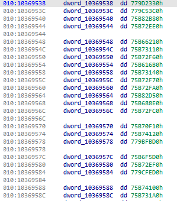
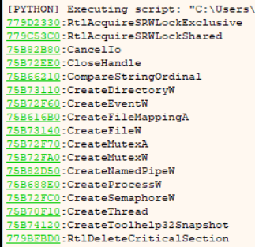

# x64dbg Scripts
This repo contains all the scripts that i deem as useful for investigations

## Installation
[x64dbgpy](https://github.com/x64dbg/x64dbgpy) is a POORLY documented API. However, someone have done a lot of work for us to associate python with the x64dbg cpp libraries that allow us to tap into x64dbg functions directly using Python, so gotta give credits where credits is due. Thanks x64dbg team for continuing the work!

Follow the installation steps [here](https://github.com/x64dbg/x64dbgpy/releases/tag/8c0538a).

## File index
`resolvesymbols.py`

When statically investigating a file on Ida, it is very common to have a decrypted shellcode that contain resolved imported address (i.e. in 32bit directly `jmp` or `call` into `0x7#######` address space). The problem with these direct branch to resolved import addresses is that Ida does not have the resolved symbols to identify what those addresses are ahead of time.

An example of such resolved import addresses can be seen from the screenshot below

However, when we debug the sample (using x64dbg), the debugger knows what those resolved addresses point to and automatically labels these addresses with its associated functions.

This script attempts to retrieve all the symbols that have been autolabelled by the debugger so that we can use an Ida script to quickly resolve those names with its associated symbols.

